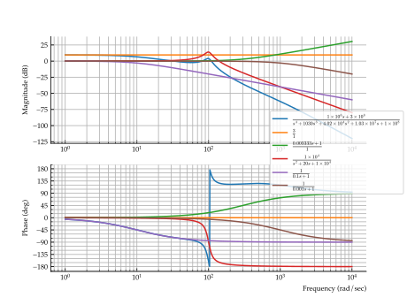

# DySys

A Python package for system dynamics and control systems utilities (using numpy, sympy, and control)

# Installation

This package now published on PyPI and can be installed with

```python
pip install dysys
```

# Usage

To import the package into a script, use

```python
import dysys as ds
```

## Symbolic State-Space Models

Create a symbolic state-space model:

```python
A = [[-4, -3, 0], [0, -8, 4], [0, 0, -1]]
B = [[0], [1], [0]]
C = [[0, 1, 0]]
D = [[0]]
sys = ds.sss(A, B, C, D)  # Create a symbolic state-space model
```

## Factoring a Transfer Function

```python
import dysys as ds
import control
import matplotlib.pyplot as plt
```

Define a transfer function using the `dysys` package as follows:

```python
H = ds.tf(
    [1_000_000, 300_000_000],  # Numerator coef's
    [1, 1030, 40200, 10_300_000, 100_000_000]  # Denominator coef's
)
```

Get a list of transfer functions that are the canonical factors of `H`{.py}:

```python
factors = H.factor_canonical(check=True)  # Check that the factors are correct
```

Print the factors:

```python
for factor in factors:
    print(factor)
```

$\frac{3}{1}$  
$\frac{0.003333 s + 1}{1}$  
$\frac{1 \times 10^{4}}{s^2 + 20 s + 1 \times 10^{4}}$  
$\frac{1}{0.1 s + 1}$  
$\frac{1}{0.001 s + 1}$

Generate a Bode plot:

```python
control.bode_plot([H] + factors, dB=True, wrap_phase=True)
plt.gcf().legend(
    list(map(lambda x: x._repr_latex_()[1:-1], [H] + factors)), 
    loc="outside center right",
)
plt.show()
```



# Issues

If you have issues, please report them on the [issues page](https://github.com/ricopicone/sysdynutils/issues).
